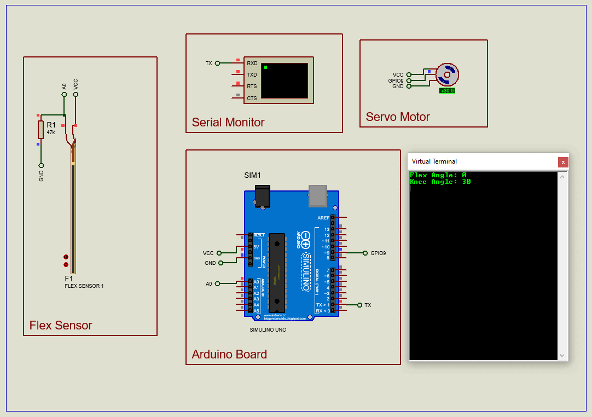

# 🦿 Arduino Knee Movement Gait Simulator

  

## 📖 Overview
This project simulates knee movement through different phases of the gait cycle using an Arduino, a flex sensor, and a servo motor. The flex sensor, attached to one knee, provides real-time input on its angle. The Arduino processes this input to determine the current gait phase. Based on this phase, the servo motor adjusts to the expected angle of the opposite knee to replicate the natural knee movement during walking.

This simulation could be useful for studying biomechanics, rehabilitation, and prosthetic design by accurately modeling how one knee's motion affects the other.

### 🚶‍♂️ Gait Phases

The following table outlines the gait phases and their corresponding knee angles for both legs during the walking gait cycle according to [Physiopedia](https://www.physio-pedia.com/The_Gait_Cycle):

| Leg 1 Phase       | Leg 1 Knee Angle (Degrees) | Leg 2 Phase       | Leg 2 Knee Angle (Degrees) |
|-------------------|----------------------------|-------------------|----------------------------|
| Initial Contact   | `0°`                       | Toe Off           | `30°`                      |
| Foot Flat         | `15°`                      | Early Swing       | `60°`                      |
| Midstance         | `5°`                       | Mid Swing         | `30°`                      |
| Heel Off          | `0°`                       | Late Swing        | `0°`                       |
| Toe Off           | `30°`                      | Initial Contact   | `0°`                       |
| Early Swing       | `60°`                      | Foot Flat         | `15°`                      |
| Mid Swing         | `30°`                      | Midstance         | `5°`                       |
| Late Swing        | `0°`                       | Heel Off          | `0°`                       |

The Gait Cycle is depicted in the picture below. 

## 🛠️ Components 

- **Arduino Uno**: The brain of the operation.
- **Flex Sensor**: Measures the angle of one knee.
- **Servo Motor**: Simulates the movement of the other knee.

## ⚙ Arduino Implementations

This project includes two different Arduino files, both found in the Arduino folder of this repository:

1. **`gait_knee_movement.ino`**: This implementation simulates the knee movement according to the phases of the gait cycle. The flex sensor provides input from one knee, and the servo motor adjusts to the corresponding angle that the other knee should be in during a natural walking gait cycle.

2. **`knee_movement.ino`**: This file is a simpler demonstration that simulates the full range of knee motion from 0 to 130 degrees using a servo motor. It does not involve a flex sensor and is primarily used to show the servo's capability to replicate the knee's range of motion.

## 🖥️ Running the Proteus 8 Simulation 
1. Ensure you have Proteus 8 installed.
2. Navigate to the Proteus 8 folder of this repository.
3. Open the provided `.pdsprj` file in Proteus.
4. Load the `.hex` file into the Arduino Uno microcontroller.
5. Press the "Run" button in Proteus to start the simulation.

## 📝 Notes

- The offsets applied to each gait phase in the Arduino code were adjusted to work optimally with the simulation in Proteus 8, taking into account the limitations of the flex sensor. In real-life implementations, these offsets may need to be recalibrated to match the specific characteristics of the hardware used and the natural gait pattern of the user.

## 👥 Authors

- 

## 🙏 Acknowledgments 
- Special thanks to [Electronics Tree](https://electronicstree.com/) for creating and sharing the animated [flex sensor](https://electronicstree.com/flex-sensor-proteus-8-library/) for Proteus 8.

## 🤝 Contributing

Contributions are welcome! Feel free to submit pull requests or open issues if you encounter any problems.

## 📜 License

This project is licensed under the MIT License - see the [LICENSE](LICENSE) file for details.
